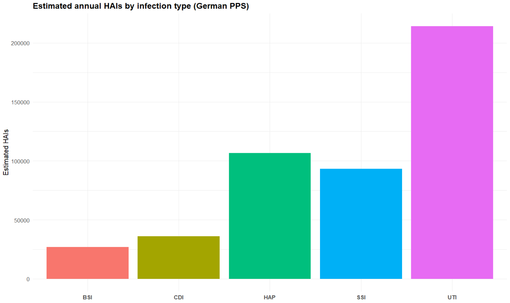

```{r, include = FALSE}
knitr::opts_chunk$set(
  collapse = TRUE,
  comment = "#>"
)
```

```{r setup, echo=FALSE}
library(shayhai)
```

## Introduction

The shayhai package provides data and helper functions to explore the burden of healthcare-associated infections (HAIs) using two major point prevalence surveys (PPS):

- a German PPS sample

- the EU/EEA PPS coordinated by ECDC. 

After this vignette, you should be able to:

1. install and load the package

2. inspect the included datasets

3. summarise HAI burden (HAIs, deaths, DALYs) by infection type

4. understand what the interactive Shiny app can show you

## Data in shayhai

Two core data frames ship with the package:

- `shayhai_cases`: German PPS cases

- `shayhai_cases_ecdc`: EU/EEA PPS cases (ECDC survey)

Each row is a simulated or weighted “case” representing part of the total population burden.

Important columns include:

1. `infection_type`: Infection category (e.g. `HAP`, `SSI`, `BSI`, `UTI`, `CDI`)

2. `weight_pop`: How much this record contributes to the population-level total
when we scale up to annual national burden

There are also patient / infection descriptors you can use for filtering and plotting in your Shiny app.

A quick look at the German sample:

```{r}
head(shayhai_cases)
```

The EU/EEA sample:

```{r}
head(shayhai_cases_ecdc)
```

## Usage

### Summarising Table of Burden by Infection Type


The function `summarise_burden_totals()` aggregates a case-level dataset (either   `shayhai_cases` or `shayhai_cases_ecdc`) and returns per-infection totals for:

- estimated HAIs

- attributable deaths

- YLL (years of life lost)

- YLD (years lived with disability)

- DALYs (YLL + YLD)

```{r}
germany_summary <- summarise_burden_totals(shayhai_cases)
germany_summary
```

### How to read this summary:

- `n_hai_est`: Estimated annual HAIs of that infection type.

- `deaths_est`: Estimated attributable deaths linked to that infection type.

- `DALYs`: Total health loss (fatal + non-fatal). DALYs = YLL + YLD.

*Higher values = higher public health impact for that infection type*

### Quick Visual: Which HAI type has the most estimated HAIs?

Below is a simple bar plot based on the German PPS totals.

```{r quick-bar-plot-image, echo=FALSE, fig.cap="Bar plot showing estimated annual HAIs by infection type in the German PPS sample.", out.width='70%'}

```

This is the kind of figure you could drop into a report to communicate “which infection types matter most”.

### Using the Shiny app

The package also includes an interactive Shiny dashboard (shayhai::run_app()) to visually explore burden across infections, demographic groups, and regions.

The app has three main plot views plus a summary table.

Here’s how to interpret each one:

#### 1. Bubble plot: DALYs vs deaths vs cases

This view matches what you see in the app’s “**Bubble plot**” tab.

- Each bubble is one infection type (HAP, SSI, BSI, UTI, CDI).

- X = estimated number of HAIs (weighted).

- Y = attributable deaths (weighted).

- Bubble size = DALYs (weighted).

- Colour = survey module (German PPS vs. ECDC PPS).

How to use it:

- The checklist on the left lets you include/exclude infection types.

- Hover on a bubble to see all the values at once.

#### 2. Bar plot with 95% UI

This view corresponds to the app tab “**Bar plot with 95% UI**”.

- Bars compare German PPS vs ECDC PPS for each infection type.

- Switch the metric in the sidebar.

- Error bars showing the 95% uncertainty interval (UI).

- Colour = survey module (German PPS vs. ECDC PPS).

How to use it:

- This plot helps you compare the two data sources directly.

- The filters on the left also let you choose which infection types to include.

#### 3. Age pyramid: Weighted DALYs by gender and age group

This view corresponds to the app tab “**Age pyramid**”.

- The left side of the pyramid is Female, the right side is Male.

- The width of each bar shows total DALYs (weighted) in that age band.

- Colour = survey module (German PPS vs. ECDC PPS).

How to use it:

- Combine this with filters (infection type, etc.) to zoom in on a specific problem group.

## Sources and Notes

These datasets are simplified teaching versions used for ETC5523.

They reflect burden estimates from:

- A representative German PPS (46 hospitals, 9,626 patients, 2011)

- The EU/EEA PPS coordinated by ECDC (273,753 patients across 29 countries, 2011–2012).

The summary metrics (HAIs, attributable deaths, DALYs, and their components YLL / YLD) follow the same general structure used in burden-of-HAI studies.

This vignette is intended for exploring and communicating results, not for clinical decision-making.

## Acknowledgements

- Package scaffolding and documentation are made possible by the R packaging ecosystem, especially `usethis`, `devtools`, and `roxygen2`.

- Interactive exploration is built with `shiny`, `plotly`, and `ggplot2`.

- Data wrangling and formatting rely on `dplyr`, `tidyr`, and `scales`.

The burden‐estimation framework used here draws on the general principles of the Burden of Healthcare-Associated Infections (BHAI) methodology by [Zacher et al., 2019](https://doi.org/10.2807/1560-7917.ES.2019.24.46.1900135), which models infection incidence, attributable mortality, and DALYs from European point prevalence survey data.

This vignette was developed for the ETC5523 Communicating with Data assignment. Reuse follows the package LICENSE terms; interpretation and errors are my own.
